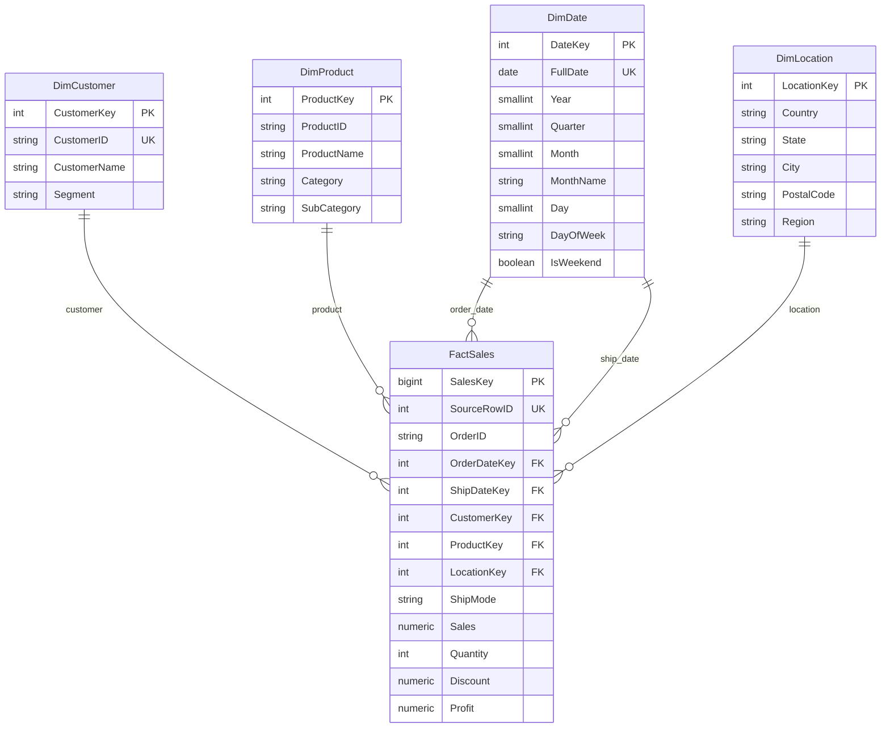

# Star Schema Design

## Purpose and Scope

This document records the Phase 2 model and the Phase 3 implementation that was audited against the live PostgreSQL catalog. The five warehouse tables and all of their columns are documented in [data_dictionary.md](data_dictionary.md); the catalog, key roles, nullability, and constraints matched the SQL scripts on 2026-10-01. The source workbook remains unchanged.

The project uses PostgreSQL, as specified in `plan.md`. The data dictionary contains the implemented PostgreSQL data types; this document explains the model and relationships.

## Terms Used

- A **data warehouse** is a database organized to support analysis and reporting.
- A **star schema** is a warehouse layout with one central fact table connected directly to descriptive dimension tables.
- A **fact table** records measurable business events. Here, `FactSales` records order lines and their measures.
- A **dimension table** stores descriptive context used to group, filter, and explain facts, such as customer, product, date, or location.
- The **grain** is the precise meaning of one row in a fact table.
- A **measure** is a value that can be analyzed or aggregated, such as sales or quantity.
- A **natural/business key** is an identifier supplied by the source business, such as `Customer ID`.
- A **surrogate key** is a new identifier assigned by the warehouse, independent of the source, to identify a dimension or fact row.
- A **primary key (PK)** is the column or columns that uniquely identify a row in a table.
- A **foreign key (FK)** is a column or columns that refer to a primary key in another table.
- A **unique key (UK)** is a column or group of columns that must not repeat between rows.
- A **composite key** uses two or more columns together as one identifier; neither column needs to be unique by itself.
- An **alternate unique key** is a second unique identifier kept in addition to the table's primary key.
- An **additive measure** can be meaningfully summed across rows. A **non-additive measure** cannot be summed directly; a discount rate is an example.
- **Normalization** organizes data to reduce unintended duplication and update inconsistencies. A star schema intentionally keeps useful descriptive attributes together in dimensions to make analysis easier.
- A **role-playing dimension** is one dimension reused for different meanings. `DimDate` plays the order-date and ship-date roles.

## Grain and Fact Table

### Grain

One `FactSales` row represents **one product line within one order**, matching the preferred grain in `plan.md` and the implemented fact table.

The Phase 1 profile reports 2,323 rows and 2,323 unique `Row ID` values. A separate read-only check of the same source sheet confirmed that all 2,323 `(Order ID, Product ID)` pairs are also unique in this snapshot (zero duplicate pairs; maximum pair count is one). This supports the implemented grain for the supplied file. It does not prove that the pair must remain unique in future data: a later export could contain the same product on multiple lines of one order. Therefore, `Row ID` is retained as a unique source-row identifier, while the pair is a validated snapshot-level candidate key rather than the only row identity.

The profile also reports that 575 orders span multiple rows (up to 10), and confirms that order-level customer, order date, ship date, and ship mode values are consistent within each order. Repeated `Order ID` values are therefore expected at this line grain.

### `FactSales`

`FactSales` is the center of the star schema. It stores:

- Order context: `OrderID`, `SourceRowID`, and `ShipMode`.
- Foreign keys to customer, product, location, and the two date roles.
- Measures: `Sales`, `Quantity`, `Discount`, and `Profit`.

`Sales`, `Quantity`, and `Profit` can be summed across product lines. `Discount` is a rate and must not be added as though it were an amount; an average or a separately defined weighted calculation is more meaningful. The source has 741 negative-profit rows, so negative `Profit` values must remain valid facts rather than being discarded.

The implemented DDL also declares `UNIQUE (OrderID, ProductKey)`. This guards against repeating a product-dimension member within one order in this supplied snapshot. Because a `ProductID` can have multiple observed names, this constraint is not identical to uniqueness of the source `(Order ID, Product ID)` pair. `SourceRowID` remains the fact row's source-backed unique identifier. The extra order/member uniqueness rule is recorded as a decision point in [audit_phases_1_to_5.md](audit_phases_1_to_5.md).

`SalesKey` is the warehouse surrogate primary key for a fact row. `SourceRowID` preserves the source's unique `Row ID` for traceability and is implemented as an alternate unique key. `OrderID` is a business order identifier, but it is not a fact-row key because it repeats across lines. No separate order dimension is included: the profile finds no within-order variation in customer, dates, or ship mode, and this source has no additional order-header attributes requiring a separate table.

## Dimensions and Design Decisions

### `DimCustomer`

The natural/business key is `CustomerID`; the warehouse key is `CustomerKey`. The profile finds 629 customer IDs and confirms that every ID maps to exactly one customer name and one segment. Therefore, one row per `CustomerID` is supported by the source.

### `DimProduct`

The warehouse key is `ProductKey`. The profile finds 1,310 distinct `Product ID` values, but 16 IDs map to multiple observed product names. Each ID maps to one category and one sub-category. Therefore, `ProductID` alone cannot identify one unambiguous product row without choosing or correcting a source name, and this design does not invent such a correction.

Instead, define a product-dimension member as one observed `(ProductID, ProductName)` combination after the ETL's outer-whitespace trimming, with its observed `Category` and `SubCategory`. The source and the loaded dimension both contain 1,326 distinct product-member combinations; the ETL removes four trailing-space occurrences from one product-name label. `ProductID` is retained as a business identifier but is not unique in this dimension; the implemented natural key is `(ProductID, ProductName)`. Category and sub-category are consistent for each product ID according to the profile. Other distinct names are preserved without selecting an invented canonical product name.

This is a deliberate source-preserving compromise. In a strict normalized catalog, the 16 conflicting identifiers would need authoritative resolution or a separate alias/history model. Until that evidence exists, splitting or selecting a preferred name would risk losing source facts. The flat product dimension keeps the observed product label beside each product member for straightforward reporting.

### `DimDate`

Use one calendar-day row per `FullDate`. The profile gives an order-date range of **2013-01-03 through 2016-12-30** and a ship-date range of **2013-01-07 through 2017-01-05**. Generate the calendar dimension for the inclusive union of those ranges: **2013-01-03 through 2017-01-05**. This ensures every order and ship date has a matching date row and allows date attributes such as year, quarter, month, day, weekday, and weekend status to be used consistently.

`FullDate` is the natural key. `DateKey` is a deterministic calendar key represented as `YYYYMMDD` (for example, 20130103), not an arbitrary sequence. `OrderDateKey` and `ShipDateKey` in the fact each reference `DimDate.DateKey` but represent different roles.

### `DimLocation`

The natural key is the full source tuple `(Country, State, City, PostalCode)`; `LocationKey` is its surrogate key. Phase 1 found 195 postal codes. A read-only check found that each postal code maps to exactly one `(Country, City, State)` tuple in this particular dataset. However, four `(City, State)` pairs have multiple postal codes, so city and state alone are not sufficient to identify the location. Although postal code alone happens to identify the 195 observed tuples here, retaining the full tuple avoids assuming postal-code uniqueness outside this single-country snapshot and makes the source location definition explicit.

`Country` is `United States` throughout and `Region` is `Central` throughout, according to the profile. Keep both as location attributes so the source's geographic columns remain represented and reports can show their scope. Their constant values mean they add no variation within this dataset; they are not independent dimensions here.

### Ship Mode

Keep `ShipMode` as a text attribute in `FactSales`; do not add `DimShipMode` in this design. The profile finds only four modes and gives no additional shipping-mode attributes. A separate lookup would add a table and join without adding descriptive information in this source. Keeping the value in the fact is a simple choice for this small project. If later sources add service-level descriptions or shipping classifications, a dedicated dimension can be reconsidered.

## Keys and Relationships

Each dimension-to-fact relationship is one-to-many: one dimension member can be referenced by many sales lines, while each fact row has one member in that dimension role.

| Dimension primary key | Fact foreign key | Meaning |
|---|---|---|
| `DimCustomer.CustomerKey` | `FactSales.CustomerKey` | Customer who placed the order line |
| `DimProduct.ProductKey` | `FactSales.ProductKey` | Exact source product ID/name member on the line |
| `DimDate.DateKey` | `FactSales.OrderDateKey` | Date the order was placed |
| `DimDate.DateKey` | `FactSales.ShipDateKey` | Date the order was shipped |
| `DimLocation.LocationKey` | `FactSales.LocationKey` | Source location associated with the order line |

The two date foreign keys point to the same `DimDate` primary key but have different names and meanings. There are no dimension-to-dimension foreign keys, so the implemented design has no circular dependencies.

## Normalization Check

The **first normal form (1NF)** idea is that each cell stores one value rather than a list. The **third normal form (3NF)** idea is that non-key descriptions depend on the key of their row, not on another non-key description. Star schemas commonly relax some 3NF separation by keeping useful labels together in a dimension; this is intentional for reporting, not an accidental fact-table duplication.

| Table | Check and result |
|---|---|
| `DimCustomer` | One row per `CustomerID`; the profile verifies one name and one segment per ID. Customer descriptions therefore have a clear business-key dependency. The surrogate `CustomerKey` provides a stable warehouse PK. |
| `DimProduct` | One row per exact `(ProductID, ProductName)` member because 16 product IDs have multiple source names. Category and sub-category are consistent per ID in the profile. This preserves facts without inventing a canonical name, but repeated category labels across name variants are an intentional dimensional denormalization. A strict catalog normalization should wait for authoritative product-name resolution. |
| `DimDate` | One row per calendar date. Year, quarter, month, month name, day, weekday, and weekend flag are derived from `FullDate`, so no independently maintained date label is needed. |
| `DimLocation` | One row per observed `(Country, State, City, PostalCode)` tuple. The full tuple distinguishes locations; country and region are constant in this extract and retained for scope/context. |
| `FactSales` | Measures and transaction-level attributes are stored at the declared line grain. Dimension descriptions are not copied into the fact; dimension foreign keys provide that context. `OrderID` and `SourceRowID` remain in the fact for order analysis and lineage. |

All source fields are atomic in the implemented representation. No normalization change is recommended for customer, date, or location. Product-name conflicts are the one source issue that prevents a simple one-row-per-ProductID catalog; keep the observed variants distinct and review before any future canonicalization.

## Mermaid ERD

The diagram uses `||` for exactly one referenced dimension row and `o{` for zero or many fact rows. PK and FK labels identify the key columns. It uses short logical type labels for readability; the data dictionary lists every implemented column with its exact PostgreSQL type, length/precision, and key role.

In `DimProduct`, the natural-key uniqueness is composite `(ProductID, ProductName)`; Mermaid's ERD notation does not show that composite constraint explicitly. In `DimLocation`, the source natural key is composite `(Country, State, City, PostalCode)`. See [data_dictionary.md](data_dictionary.md) for the full column-level mapping.

## Implemented Design Assumptions

- Use one fact row per source row/order line. `Row ID` is unique in the supplied snapshot and is preserved as `SourceRowID`.
- The observed `(Order ID, Product ID)` pair is unique in this snapshot, but do not depend on it as the only fact-row identity in future exports.
- Treat exact `(ProductID, ProductName)` source pairs as separate product-dimension members until an authoritative rule resolves the 16 conflicting IDs and the trailing whitespace.
- Treat one calendar day as one `DimDate` row and include every date from 2013-01-03 through 2017-01-05 inclusive.
- Derive `IsWeekend` from `FullDate`: Saturday and Sunday are true; Monday through Friday are false.
- Treat `(Country, State, City, PostalCode)` as the location natural key; postal code alone is only verified as unique for this supplied extract.
- Keep `ShipMode` in the fact table unless a later source supplies additional shipping-mode descriptions or attributes.
- Keep `Country` and `Region` in `DimLocation` even though each is constant in this extract, so the 21 source columns are accounted for.
- Use the implemented PostgreSQL types, precision, identity definitions, nullability, and constraints listed in the data dictionary and SQL files; these were compared with the live catalog.

## Design and Implementation Validation

- **Source fields accounted for:** all 21 source columns map to a dimension or fact column; none is dropped.
- **Fact grain:** supported by 2,323 unique `Row ID` values and 2,323 distinct `(Order ID, Product ID)` pairs in the supplied snapshot.
- **Foreign keys:** all five fact foreign-key columns point to the declared primary key of an existing dimension; the two date FKs point to `DimDate.DateKey` in separate roles. The live catalog contains all five foreign keys.
- **Circular dependencies:** none; dimensions do not reference the fact or each other.
- **Table count:** five implemented tables with 37 documented columns, meeting the assignment minimum of five.
- **Physical schema:** actual types, nullability, primary keys, foreign keys, unique constraints, and check constraints match [data_dictionary.md](data_dictionary.md) and `sql/01_create_database.sql` through `sql/04_constraints.sql`.
- **Source workbook:** read-only checks only; it was not modified.
- **Audit evidence:** catalog and rerun results are recorded in [audit_phases_1_to_5.md](audit_phases_1_to_5.md).
